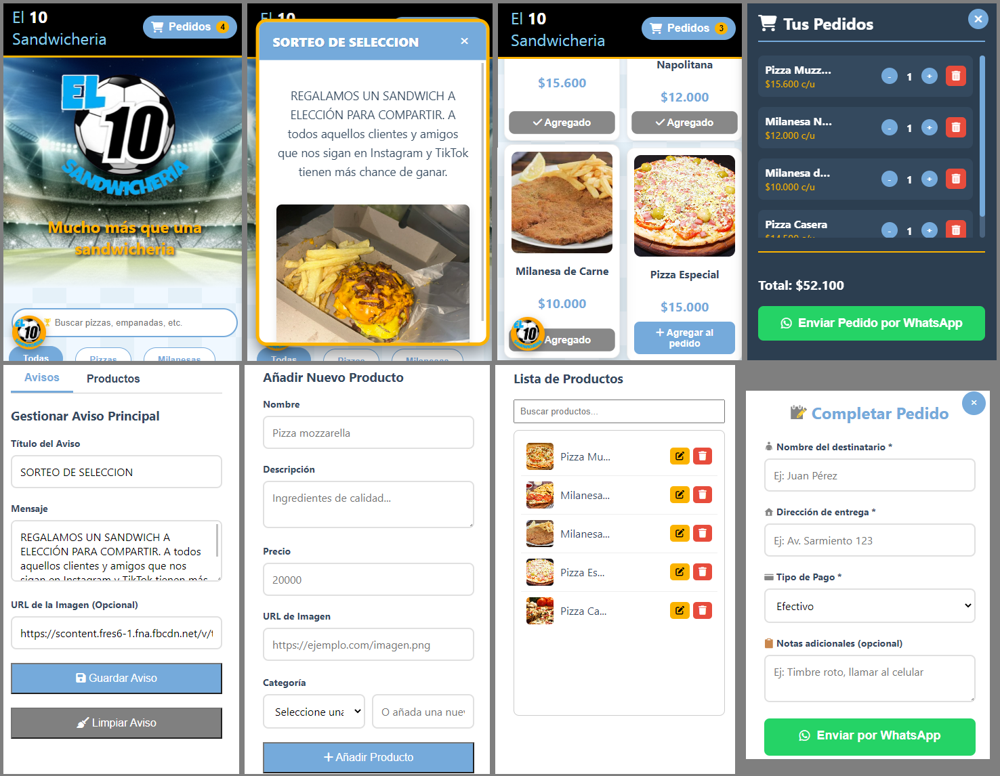

# 🍔 Sandwichería El 10 - Catálogo Digital con Panel de Administración

Este proyecto es un catálogo digital interactivo para la "Sandwichería El 10", desarrollado con **HTML, CSS y JavaScript puros (Vanilla JS)**, utilizando **Firebase** como backend para la gestión de productos, avisos y autenticación de administradores en tiempo real.

**➡️ Ver demo en vivo:** [Sandwichería El 10](https://sandwicheriael10.vercel.app/)

---

## ✨ Un Proyecto Preparado para un Escenario Real

Más que un simple ejercicio, este catálogo fue construido pensando en las necesidades y desafíos de un negocio real. No solo funciona, sino que está diseñado para ser **seguro, robusto y fácil de administrar**.

#### ¿Por qué es un buen ejemplo de un sitio real?

1.  **Seguridad como Prioridad (Anti-XSS):**
    * Todo el contenido que proviene de la base de datos (nombres de productos, descripciones, avisos) se renderiza de forma segura.
    * Se evita el uso de `.innerHTML` para insertar datos, neutralizando por completo los ataques de **Cross-Site Scripting (XSS)**. Un atacante no puede inyectar scripts maliciosos a través del panel de administración, protegiendo tanto a los clientes como al administrador.

2.  **Panel de Administración Integrado:**
    * Permite al dueño del negocio gestionar el menú y los avisos promocionales **sin tocar una sola línea de código**.
    * El panel está protegido por el sistema de **Autenticación de Firebase**, asegurando que solo usuarios autorizados puedan realizar cambios.

3.  **Experiencia de Usuario Fluida (UX):**
    * La interfaz es rápida y reactiva. Se incluyen indicadores de carga, notificaciones visuales para acciones (como "Producto añadido"), y botones que reflejan su estado (ej. "Agregado ✔️").
    * El diseño es **100% responsivo**, garantizando una experiencia óptima tanto en computadoras de escritorio como en dispositivos móviles.

4.  **Integración Directa con el Negocio:**
    * El flujo finaliza con la generación de un mensaje de **pedido formateado para WhatsApp**, agilizando el proceso de compra y eliminando fricciones para el cliente.

5.  **Aplicación Web Progresiva (PWA):**
    * El sitio se puede **"instalar"** en computadoras y dispositivos móviles para un acceso rápido y una experiencia similar a una aplicación nativa, gracias a su configuración como PWA.

---

## 🚀 Características Principales

* **Menú Dinámico:** Los productos y categorías se cargan en tiempo real desde Firebase Realtime Database.
* **Carrito de Compras:** Funcionalidad completa para añadir, eliminar y modificar la cantidad de productos.
* **Búsqueda y Filtrado:** Permite a los clientes encontrar productos fácilmente por nombre o categoría.
* **Gestión de Contenido:**
    * **CRUD de Productos:** Crear, leer, actualizar y eliminar productos desde el panel de admin.
    * **Gestor de Avisos:** Publicar y limpiar avisos promocionales que aparecen como pop-ups en la página.
* **Paginación:** Organiza el menú en varias páginas para una navegación más limpia cuando hay muchos productos.
* **Instalable como PWA (Progressive Web App):** Gracias al archivo `manifest.json`, la web puede ser instalada en el escritorio o en la pantalla de inicio de un móvil para un acceso directo y funcionamiento sin conexión (offline-first).

---

## 🛠️ Tecnologías Utilizadas

* **Frontend:** HTML5, CSS3, JavaScript (ES6 Modules, Vanilla JS).
* **Backend & Base de Datos:** Firebase (Realtime Database, Authentication).
* **Iconografía:** Font Awesome.

## No olvides darle ⭐ a este repositorio si te gustó.
